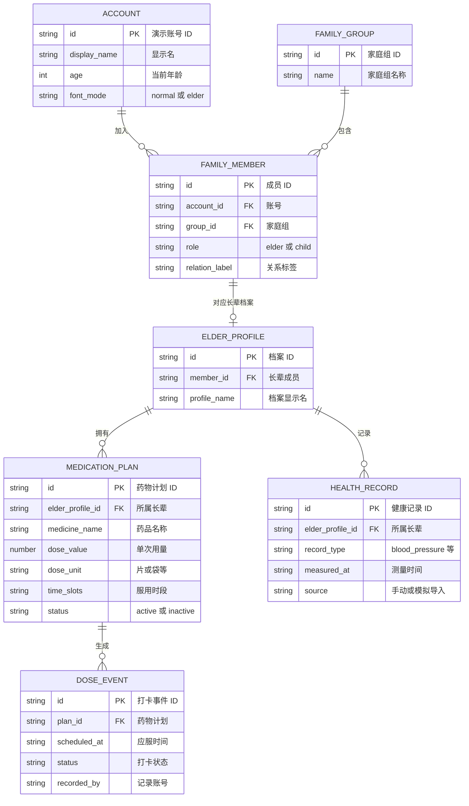
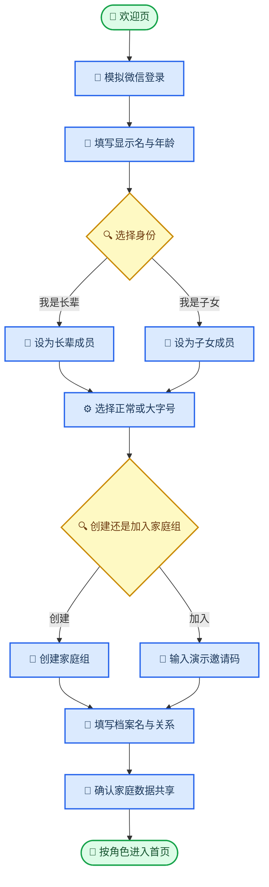
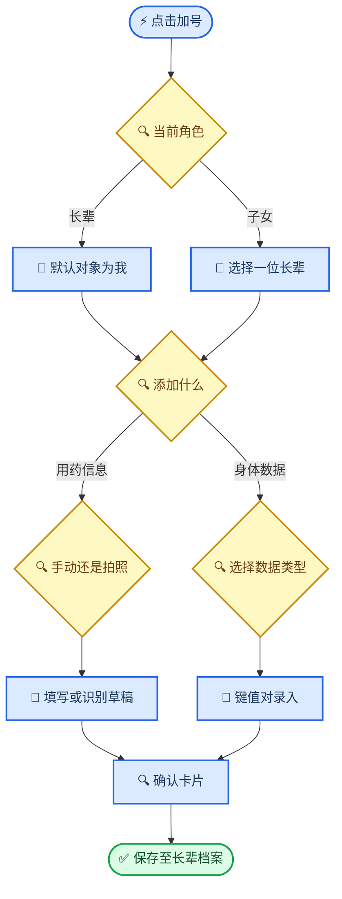

# 银龄健康管家：双端家庭协同 MVP 文档 v1

_用于复客松展示版的产品与开发边界。本文将“老人端 + 子女端 + 一套家庭数据”收束为一个可在静态 HTML 中完整演示的最小闭环，而不是实现真实医疗平台。_

---

## 🎯 版本目标与边界

### 一句话产品定义

> **子女帮长辈建好用药计划；长辈在当下时段一键完成服药打卡；子女随时看到同一份服药与血压记录。**

比赛版要证明的不是“功能最多”，而是以下闭环真的顺畅：

```text
子女添加/确认药物 → 系统按时段生成任务 → 长辈一键打卡 →
双方看到同一条记录 → 子女在未按时打卡时发起提醒
```

### v1 的产品原则

| 原则 | v1 的具体做法 |
| --- | --- |
| 当下优先 | 长辈首页只突出“这个时段该做什么”，而不是完整健康后台 |
| 家庭协同 | 两种账号共享同一家庭组中的健康档案；子女不是第二套独立数据 |
| 先确认后生效 | 拍照识别、录入药物、跳过服药都先显示可编辑确认信息 |
| 不作医疗判断 | 不诊断、不改处方、不推荐停药、不根据数值给出医疗结论 |
| 先做可演示的真闭环 | 页面交互、状态变化、两端数据同步展示要真实；外部能力可明确标注为模拟 |
| 适老化不是另一套产品 | 角色决定内容重点，字号模式决定呈现尺度；两者通过同一组件系统组合 |

### v1 明确不承诺的能力

- 真实微信授权登录、跨手机实时同步、真实家庭邀请码验证
- 真正的药盒 OCR、药品数据库核验、药物相互作用判断
- 定时推送、短信、电话、120 或紧急救援联动
- 血压/血脂异常诊断、阈值预警、疾病风险预测
- 血压计、手环、华为健康、Apple Health 等真实设备接入
- 医生端、社区端、在线问诊、购药配送

> ⚠️ **展示边界：** HTML 原型中的所有健康数据应为演示数据，并在“我的”页或演示说明中明确写出“本版本不提供医疗建议，不应用于真实用药决策”。

---

## 👥 用户、账号、家庭组与数据权限

### 三个必须分开的概念

很多后续混乱，来自把“账号”“长辈档案”“家庭关系”当成同一件事。v1 必须按下表理解：

| 概念 | 含义 | v1 例子 |
| --- | --- | --- |
| 账号 | 一个登录的人 | 张阿姨账号、女儿小李账号 |
| 家庭组 | 用于协同授权的数据容器，不等同于微信聊天群 | “张阿姨的健康小家” |
| 长辈健康档案 | 被记录用药、打卡和身体数据的对象 | 张阿姨健康档案 |
| 家庭成员角色 | 账号在某个家庭组中的身份 | 张阿姨 = 长辈；小李 = 子女 |

**v1 的简化规则：**每位选择“我是长辈”的账号自动拥有一份自己的长辈健康档案；每位选择“我是子女”的账号可在已绑定的长辈档案间切换查看和协助录入。

### 家庭组成员与权限矩阵

| 操作 | 长辈 | 子女 | v1 规则 |
| --- | --- | --- | --- |
| 查看自己的用药/身体数据 | 可以 | 不适用 | 长辈默认进入自己的档案 |
| 查看组内其他长辈数据 | 不可以 | 可以，限已绑定长辈 | 保护长辈之间的隐私 |
| 为自己添加药物/健康数据 | 可以 | 不适用 | 点击加号后默认对象为自己 |
| 为长辈添加药物/健康数据 | 不适用 | 可以，须先选具体长辈 | 数据卡片记录“由谁添加” |
| 完成长辈的服药打卡 | 可以 | v1 仅查看，不代打 | 防止家属误把“已提醒”当成“已服用” |
| 发起提醒 | 可不做 | 可以，演示为模拟提醒 | 不承诺真实推送 |
| 修改显示字号 | 可以 | 可以 | 每个账号独立保存偏好 |

> 📌 **重要取舍：**“子女可以添加用药信息”不等于“子女可以替长辈确认已经吃药”。前者是家庭协助录入；后者会把服药事实和家属操作混为一谈。**v1 中，子女不能替长辈确认“已服用”。**

### 关系命名规则

不要根据微信性别自动把长辈命名为“父亲”或“母亲”。这会误判祖父母、配偶、亲属、非二元性别用户，也可能拿不到可靠的微信性别数据。

**推荐流程：**子女绑定长辈时，手动填写或选择：

- 显示名：`张阿姨`、`爸爸`、`外婆`
- 与我的关系：`父亲`、`母亲`、`祖父母/外祖父母`、`配偶`、`其他`
- 是否为需要管理的长辈：`是`

首页和选择器优先显示“显示名”；关系只是辅助标签。例如：`张阿姨 · 母亲`。

### v1 数据关系



### v1 的演示账号设定

为了让 HTML 原型能够展示“双端共享”，建议内置两个可切换的演示账号，而不是一开始开发真实登录：

| 账号 | 角色 | 默认看到的内容 |
| --- | --- | --- |
| 张阿姨 | 长辈 | 自己当前时段的药物、自己的血压与历史 |
| 小李 | 子女 | 张阿姨及其他已绑定长辈的日程、数据与提醒入口 |

两种账号读写同一个 `familyId` 下的演示数据。浏览器中使用 `localStorage` 保存即可；切换账号后应立刻看到同一条新增药物和打卡记录。

---

## 🔄 两类核心使用场景

### 场景 A：首次进入、完成家庭绑定与基础配置



**页面顺序与字段：**

1. **欢迎页**：产品一句话价值 + `模拟微信登录`按钮。
2. **基础资料**：显示名（必填）、当前年龄（必填，正整数）。真实产品更适合填写出生日期并自动计算年龄；比赛版按你的设想先用当前年龄即可。
3. **身份选择**：`我是长辈` / `我是子女`。年龄不自动决定身份，用户主动选择才决定首页和家庭组角色。
4. **显示模式**：`正常适中字号` / `适老大字号`。两个角色都能选择两种模式，后续可在“我的”中随时切换。
5. **家庭组**：`创建我的家庭组` / `加入家庭组`。静态演示中可使用预设邀请码，例如 `SILVER2026`。
6. **身份/关系确认**：填写健康档案显示名和关系标签。长辈给自己确认档案名；子女首次绑定时给所选长辈填写关系。
7. **数据共享确认**：说明“组内绑定的子女可查看并协助录入此长辈档案”。比赛版可用一个确认勾选框模拟授权。

### 场景 B：子女协助建立新药计划

1. 小李以子女端进入首页，点击悬浮 `+`。
2. 先选择“为哪位长辈添加”：例如 `张阿姨 · 母亲`。
3. 选择“用药信息”。
4. 在“手动输入 / AI 拍照识别”中选择一种方式。
5. 补全药品名称、单次用量、服用时段等字段。
6. 系统生成**待确认药物卡片**，小李确认后才创建计划。
7. 张阿姨端刷新或切换账号后，在对应时段看到该药物的打卡卡片。

### 场景 C：长辈在日常服药时打卡

1. 到达“早餐后”时段，张阿姨收到首页中的当前任务。
2. 页面每个药物单独显示名称、单次剂量、时段和两个大按钮：`已服用`、`跳过本次`。
3. 张阿姨点按 `已服用`，记录实际点击时间并显示一句轻量鼓励语。
4. 小李端的当天日程立刻显示该药物为“已服用”。
5. 如果过了时段仍未打卡，两端顶部都出现折叠的红色 `未按时打卡提醒` 卡片；这表示**未按时记录**，不能自动推断为漏服。

### 场景 D：手动记录血压并由子女查看

1. 张阿姨量完血压，点击悬浮 `+`。
2. 长辈端跳过“为谁添加”，直接显示“为我添加”。
3. 选择 `身体数据 → 血压`，填写收缩压、舒张压，脉搏为可选项。
4. 保存后，“身体数据”页出现本次记录；子女端切到张阿姨后能看到相同记录与简易趋势。

---

## 📋 信息架构与双端 UI

### 固定底部导航

两端都保留同一组底部菜单，降低学习成本；区别只发生在各页面展示的内容和操作权限上。

| 顺序 | 菜单 | 长辈端内容 | 子女端内容 |
| ---: | --- | --- | --- |
| 1 | 服药打卡 | 当前时段的个人药物卡片与个人未按时记录 | 所选长辈的全天日程、打卡状态、模拟提醒按钮 |
| 2 | 用药信息 | 正在服用的药物、打卡历史、添加/停用入口 | 所选长辈的药物计划、打卡历史、协助添加入口 |
| 3 | 身体数据 | 个人血压、血脂、身体指标与趋势 | 所选长辈的数据、趋势与协助添加入口 |
| 4 | 我的 | 显示名、年龄、字号、家庭组、数据共享说明 | 显示名、年龄、字号、家庭组、已绑定长辈 |

### 视觉参考的迁移方式

用户提供的参考图适合借鉴以下**布局语言**，但不直接复刻其营养业务：

- 顶部用柔和健康绿/浅蓝渐变承载日期、问候和当天完成概览
- 使用大圆角白色卡片承载单一任务，保证留白和点击区域
- 用悬浮 `+` 作为“快速添加”的唯一入口
- 用固定底部导航稳定定位四个核心页面
- 日程用“早 / 中 / 晚 / 睡前”而不是密集文字说明

### 不要做成四套独立界面

“长辈端/子女端”与“正常字号/大字号”组合后理论上有四种状态，但开发时只能维护**一套组件系统**：

| 维度 | 如何变化 | 不应该变化 |
| --- | --- | --- |
| 角色 | 首页信息、默认添加对象、权限、是否显示提醒按钮 | 数据模型、导航名称、核心卡片样式 |
| 字号 | 字号、行高、间距、按钮高度、卡片列数 | 页面信息架构与业务逻辑 |

建议的展示规格：

| 规格 | 正常适中字号 | 适老大字号 |
| --- | ---: | ---: |
| 正文基准字号 | 16 px | 20 px |
| 主要标题 | 24 px | 30 px |
| 主按钮文字 | 18 px | 22 px |
| 最小点击高度 | 44 px | 56 px |
| 卡片布局 | 可两列展示摘要 | 关键任务始终单列 |

### 长辈端首页：服药打卡

页面按优先级从上到下排布：

1. 日期条与“今天已完成 `2/3`”摘要。
2. 若存在逾期未记录任务，先显示折叠红卡：`未按时打卡提醒（2）`。
3. 当前时段标题，例如 `现在：早餐后`。
4. **每种药物一张独立卡片**：
   - 药品名称
   - `1 片/次`等单次剂量
   - 应服时段/预设时间
   - `已服用`主按钮
   - `跳过本次`次级按钮
5. 没有当前任务时，显示“本时段没有待打卡药物；下一次为晚餐后 18:30”。
6. 悬浮 `+`：默认进入“为我添加”。

`已服用`点击后直接记录，并提供 5 秒 `撤销`浮层；`跳过本次`必须再次确认，避免误触。成功打卡后显示简短而不说教的鼓励，例如：

> 今天也认真照顾自己，真棒。

### 子女端首页：服药打卡

子女端不是把长辈端简单缩小，而是展示“今日是否需要关注”：

1. 顶部为长辈切换器：`张阿姨 · 母亲 ▼`。一个子女可切换多个已绑定长辈。
2. 今日概览：`已完成 2/3`、`待打卡 1`、`未按时记录 0`。
3. 按 `早 / 中 / 晚 / 睡前` 分组的全天日程；每条显示药物、剂量、状态。
4. 对尚未完成的时段显示 `提醒 TA`。HTML 中点击后显示“已模拟发送提醒”，并写入演示提醒日志；不要伪装为真实推送。
5. 逾期任务也显示相同的折叠红卡，展开后可查看，但不可替长辈打卡。
6. 悬浮 `+`：先选择对象，再选“用药信息 / 身体数据”。

### 用药信息页

该页必须分成两个清晰区块，避免“药物计划”与“实际服药记录”混在一起：

| 区块 | 内容 | v1 操作 |
| --- | --- | --- |
| 正在服用 | 药名、单次剂量、时段、开始日期、来源、状态 | 添加、查看、停用 |
| 打卡记录 | 日期、应服时段、药名、已服用/跳过/未服用状态、实际记录时间 | 按日查看 |

v1 不建议永久删除已有药物计划。选择“停用”即可从后续日程移除，同时保留历史打卡记录。

### 身体数据页

页面顶端提供类型切换：`血压`、`血脂`、`身体指标`。每个类型统一包含：

- 最近一次数据摘要与测量时间
- 按日期倒序的记录列表
- 对血压至少提供一个简单的“收缩压 / 舒张压”趋势折线图
- 添加数据按钮
- `模拟设备导入`入口（只在演示版插入标注了来源的预设数据）

v1 不显示“正常/异常”“高危/低危”等医疗判断色块；只展示原始数据、时间和来源。

---

## ⚙️ 首次引导、家庭绑定与快速添加

### 家庭绑定的最小实现

静态 HTML 无法完成真实跨设备邀请码和微信身份校验。因此展示版采用以下规则：

| 需求 | HTML MVP 做法 | 未来小程序实现 |
| --- | --- | --- |
| 微信登录 | `模拟微信登录`按钮 + 内置演示账号 | `wx.login` 与服务端/云函数换取身份 |
| 创建家庭组 | 生成本地假 `familyId` | 后端创建真实家庭组 |
| 加入家庭组 | 输入预设邀请码后加入演示数据 | 扫码/邀请码 + 成员授权 |
| 双端共享 | 同浏览器切换账号读取同一 `localStorage` | 云数据库按家庭组同步 |
| 数据授权 | 首次进入展示确认弹窗 | 长辈明确授权、撤销与审计记录 |

### 快速添加流程



### 录入对象选择规则

| 当前角色 | 点击 `+` 后的对象行为 | 目的 |
| --- | --- | --- |
| 长辈 | 默认且固定为自己；页面显示“为我添加” | 减少不必要的选择 |
| 子女 | 必须先从已绑定长辈列表勾选一个对象 | 防止数据写错到另一位长辈名下 |

如果子女尚未绑定任何长辈，不能直接进入录入表单，应显示：`请先加入家庭组或绑定一位长辈`，并提供绑定入口。

---

## 💾 用药与健康数据字段规范

### 药物计划：不要把“一天几次”做成独立输入

“一天几次”与“服用时段”同时让用户填写，极容易矛盾：用户可能填写“每天 2 次”，却只勾选一个时段。因此 v1 中频次应由选中的时段自动计算。

#### 必填字段

| 字段 | 输入方式 | 示例 | 规则 |
| --- | --- | --- | --- |
| 药品名称 | 文本 | 氨氯地平片 | 必填；可由拍照草稿带入后编辑 |
| 单次用量 | 数字 | 1 | 必填；必须大于 0 |
| 用量单位 | 下拉 + 自定义 | 片 | 必填；候选为片、粒、袋、支、毫升、滴、喷、瓶、其他 |
| 服用时段 | 多选 | 早餐后、晚餐后 | 至少选 1 个；自动显示“每天 2 次” |
| 开始日期 | 日期 | 2026-09-13 | 默认今天，可修改 |
| 服用周期 | 单选 | 长期服用 | `长期服用` 或 `截至某日期` |

#### 可选字段

| 字段 | 用途 |
| --- | --- |
| 药盒/处方图片 | 帮助识别和回看；演示版仅本地展示 |
| 服用备注 | 例如“饭后服用”；不由 AI 自动生成 |
| 录入来源 | 系统自动记录为`手动录入`、`模拟拍照识别`或`家属协助录入` |

#### 时段与默认应服时间

为支持“当前时段”“未按时打卡”等状态，纯文本时段不够。v1 固定四个常见时段并给出可解释的默认时间：

| 时段 | 默认应服时间 | 首页显示 |
| --- | --- | --- |
| 早餐后 | 08:00 | 早 |
| 午餐后 | 12:30 | 中 |
| 晚餐后 | 18:30 | 晚 |
| 睡前 | 21:00 | 睡前 |

- 同一药物可以勾选多个时段；v1 默认认为各时段的**单次剂量相同**。
- 若真实处方是“早 1 片、晚 2 片”，v1 先不做复杂分时剂量编辑；比赛演示应使用同剂量样例。`分时不同剂量`列入 v1.1。
- “按需服用”“隔日服用”“每周一次”等非固定日程也不在 v1 内，避免错误生成每日任务。

### AI 拍照识别：只做“可编辑草稿”

**演示交互应完整，识别能力可以模拟。**

| 步骤 | 页面行为 | 真实/模拟 |
| --- | --- | --- |
| 1 | 用户上传药盒或处方图片 | 真正可做的前端文件选择 |
| 2 | 显示“正在识别”加载状态 | 模拟 |
| 3 | 返回预设药品名称、剂量、建议时段草稿 | 模拟，可按示例图文件名匹配 |
| 4 | 用户逐项编辑并点“确认创建” | 必须真实实现 |
| 5 | 创建药物计划和当日时段任务 | 必须真实实现 |

> ⚠️ **安全文案固定写入页面：**“识别结果仅用于辅助填写，请按实际处方逐项确认；本产品不提供用药建议。”

### 服药打卡状态定义

| 状态 | 何时出现 | 两端显示文案 | 是否代表实际服药事实 |
| --- | --- | --- | --- |
| 待打卡 | 尚未到应服时间，或到点后尚未操作 | 待打卡 | 否 |
| 已按时服用 | 在应服时间后 60 分钟内点“已服用” | 已服用 | 由长辈主动记录 |
| 已延时服用 | 超过 60 分钟后在逾期卡中点“已服用” | 延时服用 | 由长辈主动补记 |
| 跳过本次 | 长辈确认“跳过本次” | 已跳过 | 表示主动跳过，不评价对错 |
| 未服用 | 长辈在逾期卡中明确选择“未服用” | 未服用 | 由长辈主动声明 |
| 未按时打卡提醒 | 应服时间超过 60 分钟仍无操作 | 未按时打卡提醒 | **仅表示未记录，绝不等同于漏服** |

“未按时打卡提醒”是界面派生状态，不应自动覆盖真实服药状态。展开该卡后可逐条选择：`已服用`、`未服用`、`跳过本次`。

### 血压数据：首轮必须可真实录入

血压是 v1 健康数据中最值得先完成的一类，因为它与“老人自测—子女查看趋势”的演示价值最直接。

| 默认键 | 是否必填 | 默认单位 | 说明 |
| --- | --- | --- | --- |
| 收缩压 | 是 | mmHg | 第一行默认展示；键名可查看但不建议随意改为其他指标 |
| 舒张压 | 是 | mmHg | 第二行默认展示 |
| 脉搏 | 否 | 次/分 | 可通过第三行加号添加 |
| 测量时间 | 是 | — | 默认当前时间，可修改 |
| 数据来源 | 是 | — | 手动录入 / 模拟设备导入 |
| 备注 | 否 | — | 如“晨起后测量”；不做医疗判断 |

表单采用“键名 + 数值 + 单位”的行式结构：

```text
[ 收缩压 ▼ ] [ 132       ] [ mmHg ▼ ]
[ 舒张压 ▼ ] [ 82        ] [ mmHg ▼ ]
[ + 添加一项指标 ]
```

保存前只做结构校验：必填、数值格式、非负、收缩压大于舒张压。不要在 v1 用硬编码阈值判定病情。

### 血脂数据：先记录原始报告值，不做“控制评价”

血脂录入推荐默认带出检验报告中最常见的四项；用户可用加号补充报告上的其他指标。

| 默认键 | 英文缩写 | 默认单位 | v1 处理 |
| --- | --- | --- | --- |
| 总胆固醇 | TC | mmol/L | 可录入、可在列表显示 |
| 甘油三酯 | TG | mmol/L | 可录入、可在列表显示 |
| 高密度脂蛋白胆固醇 | HDL-C | mmol/L | 可录入、可在列表显示 |
| 低密度脂蛋白胆固醇 | LDL-C | mmol/L | 可录入、可在列表显示 |

同时记录：`检测日期/时间`、`是否空腹（可选）`、`数据来源`。如报告含 `ApoA1`、`ApoB`、`Lp(a)`、`非 HDL-C` 等，可通过“+ 添加一项指标”录入其原始名称和值。

> 📌 **v1 不做：**自动换算单位、根据血脂数值给“达标/未达标”结论、推荐用药或饮食方案。不同检验报告的参考范围、单位与个人情况可能不同。

### 身体指标：复用同一键值对组件

身体数据页可在 v1 中提供如下预设项，复用血压/血脂的行式输入组件：

| 指标 | 默认单位 | v1 是否画趋势 |
| --- | --- | --- |
| 身高 | cm | 否 |
| 体重 | kg | 可选，若时间允许再做 |
| 体脂率 | % | 否 |

这部分可以先保证“能录入、能回看”，不必在第一轮制作 BMI、体重目标、体脂评价等衍生分析。

---

## 📊 打卡、历史与页面交互规则

### 当天日程生成规则

保存一条激活药物计划后，系统为其勾选的每个时段生成当天任务。例如：

```text
氨氯地平片 · 1 片/次 · 早餐后 + 晚餐后
→ 今日 08:00 一条打卡任务
→ 今日 18:30 一条打卡任务
```

- 长辈首页只显示“当前时段”的待处理药物；多个药物分成多张卡片。
- 已过去但无记录的任务收进顶部折叠红卡，不占据当前任务的主要视觉位置。
- 历史日期只读，可在“用药信息 → 打卡记录”中查看。
- 子女端展示全天四时段，帮助判断是否需要提醒。

### 折叠的未按时打卡提醒

| 项目 | 规则 |
| --- | --- |
| 出现时间 | 默认应服时间后 60 分钟，仍没有任何打卡操作 |
| 卡片标题 | `未按时打卡提醒（N）` |
| 视觉 | 红色图标 + 文字；不能只靠颜色表达 |
| 默认状态 | 折叠，避免长期干扰长辈当前任务 |
| 展开内容 | 药名、原定时段、原定时间、三个状态操作 |
| 可选操作 | `已服用`、`未服用`、`跳过本次` |
| 绝不做的推断 | 不自动显示“漏服”、不向长辈给责备性文案 |

### 页面间的数据一致性

一条事件应在多个位置同时反映：

| 用户动作 | 服药打卡页 | 用药信息页 | 子女端 | 身体数据页 |
| --- | --- | --- | --- | --- |
| 新建药物计划 | 对应时段出现任务 | “正在服用”新增药物 | 所选长辈全天日程新增 | 无变化 |
| 长辈点已服用 | 卡片变已完成 + 鼓励 | 历史新增一条记录 | 日程状态更新 | 无变化 |
| 新增血压 | 无变化 | 无变化 | 可见最新值与趋势 | 最新记录和趋势更新 |
| 停用药物 | 后续任务消失 | 计划显示已停用 | 后续日程移除 | 无变化 |

### 角色和字号的保存行为

- 角色是家庭成员身份，不应该在“我的”页一键互换；切换会改变权限和家庭关系。展示版允许通过“切换演示账号”查看另一角色。
- 字号模式是个人偏好，可以随时切换，并在同一浏览器中持久化。
- 大字号模式切换后，按钮、卡片、导航和弹窗都必须同步变大，不能只放大正文。

---

## 🔧 实现范围、模拟范围与后置范围

### 第一轮必须真做的交互

以下内容是比赛演示最小闭环。它们不需要后端，但必须能点击、保存状态、切换角色后正确展示。

| 功能 | 为什么必须真做 | 最小实现方式 |
| --- | --- | --- |
| 演示账号与角色切换 | 证明双端不是两张孤立页面 | `张阿姨 / 小李`账号切换器 |
| 首次引导页面 | 呈现微信登录、年龄、角色、字号、家庭组设想 | 模拟表单，保存到本地状态 |
| 家庭组和长辈选择器 | 支持子女管理多位长辈的产品结构 | 预设家庭组 + `selectedElderId` |
| 角色化首页 | 体现老人“当下任务”与子女“全天关注”的差异 | 同一数据、两种主页视图 |
| 手动添加药物计划 | 打卡闭环的源头 | 必填字段、时段多选、确认卡片 |
| 模拟拍照识别后的确认 | 是本产品的有力演示点 | 上传图片 + 预设识别草稿 + 可编辑确认 |
| 单药独立打卡 | 体现每种药各自服用/跳过 | 每张药物卡各有状态按钮 |
| 未按时打卡折叠卡 | 体现家庭协同的价值 | 用演示时间或预设逾期事件生成 |
| 手动录入血压 | 体现健康数据共同查看 | 两个必填键值对 + 本地保存 |
| 用药历史与血压列表 | 证明数据没有只停留在首页 | 列表和至少一个血压趋势图 |
| 正常/大字号切换 | 落实适老化，而非只写在 PRD | CSS 变量或根节点 class 切换 |

### 应做成“可点击模拟”的功能

这些功能值得被评委看见，但不值得在第一轮开发真实基础设施。页面要清楚标注“演示/模拟”。

| 功能 | 演示做法 | 不要假装实现的部分 |
| --- | --- | --- |
| 微信登录 | 按钮进入预设演示账号 | 真实微信 OAuth、手机号绑定 |
| 家庭邀请码 | 预设邀请码或弹出“已加入” | 跨设备验证、邀请链接安全性 |
| AI 拍照识药 | 上传预设图片后返回可编辑草稿 | OCR、药品数据库、处方理解 |
| 子女一键提醒 | Toast + 提醒日志 | 订阅消息、短信、电话推送 |
| 智能设备导入 | 点击后插入 3 条示例记录，标注来源 | 蓝牙、HealthKit、华为健康 API |
| 血脂/身体指标 | 通用表单可录入、展示样例卡片 | 风险评估、健康结论、复杂图表 |
| 异常提醒 | 可展示未来规划卡片 | 阈值计算、医疗预警、急救联动 |

### 第一次先不做的功能

| 功能 | 暂缓原因 |
| --- | --- |
| 真小程序和后端 | 对零开发经验者会同时引入账号、数据库、云函数、部署和调试问题 |
| 多设备实时同步 | 静态 HTML 的 `localStorage` 无法跨手机共享；需要后端 |
| 自定义具体时刻、隔日/按需/分时不同剂量 | 用药日程规则会迅速复杂化，容易做错 |
| 真实提醒和后台定时任务 | 浏览器前端无法稳定在后台触发；小程序还涉及订阅授权 |
| 药物相互作用与用药建议 | 高风险医疗内容，不能用模拟结果替代 |
| 血压/血脂阈值告警 | 需要医学规则、个体化情况和责任边界 |
| 医生、社区、在线问诊 | 又是一套用户角色、权限与服务流程 |
| 家属代打卡、强制催促 | 会损害记录真实性，也不符合核心协同分工 |

### 推荐的技术路径

对首次开发最友好的顺序是：

1. **先做静态单页 HTML 原型**：只用 `index.html`、`styles.css`、`app.js`、`seed-data.js`。
2. **用 JavaScript 状态 + `localStorage`**：不要先接数据库；把两端“共享数据”用同一浏览器内切账号演示。
3. **数据与页面分开**：页面只能调用统一的读取/写入函数，未来接小程序或云数据库时才不必重写 UI。
4. **最后才做视觉抛光**：先保证“添加药物 → 长辈打卡 → 子女看到”跑通，再调色彩、动画和阴影。

> 💡 **最重要的诚实说明：**静态网页可以展示“共享数据的产品逻辑”，不能声称已经实现“两个真实微信账号在不同手机上同步”。比赛讲解时把这点说清，反而显得你们理解技术边界。

---

## ⚠️ 当前模糊点、漏洞与最快的修正建议

### 必须在开工前锁定的产品规则

| 模糊点或漏洞 | 为什么会出问题 | 推荐 v1 决策 |
| --- | --- | --- |
| “一天几次”与“服用时段”同时填写 | 两个值会互相矛盾 | 只填时段，自动计算每天几次 |
| 只写“早/中/晚”却要判定逾期 | 没有具体时间就无法知道何时折叠提醒 | 固定 08:00/12:30/18:30/21:00，逾期阈值固定 60 分钟 |
| 未打卡被理解成漏服 | 会造成错误健康判断和不必要焦虑 | 文案统一为“未按时打卡提醒”，只能由长辈自行选“未服用” |
| 子女可以加药也可以代打卡 | 家属行为会污染真实服药记录 | 子女可协助录入和提醒，不可代替长辈标记“已服用” |
| 微信性别自动映射父亲/母亲 | 关系假设和数据来源都不可靠 | 让用户手动填写显示名和关系 |
| 一个家庭组多个长辈如何切换 | 子女容易把数据写错给另一人 | 子女每次新增前强制选择对象；页面顶部保持当前长辈选择器 |
| 长辈是否能看到另一位长辈数据 | 可能泄露隐私 | v1 长辈仅看自己的档案，子女按授权查看已绑定长辈 |
| 药物拍照结果直接创建计划 | OCR 错误会转化为错误提醒 | 始终先生成草稿，必须人工逐项确认 |
| 血脂“控制”指标不清楚 | 可能错误解释检验报告 | 先收集 TC、TG、HDL-C、LDL-C 原始值，不做评价 |
| “设备导入”被当成真实连接 | 演示容易失真 | 标注`模拟导入`，并只插入预设演示数据 |
| 角色一键切换 | 会破坏家庭权限与档案关系 | 用“切换演示账号”代替真实产品中的角色切换 |

### 建议主动砍掉或延后的诱人功能

| 想法 | 为什么现在不划算 | 保留方式 |
| --- | --- | --- |
| 用药相互作用排查 | 需要可靠药品标准化和医学数据库 | 在“后续规划”页展示，不进入操作流 |
| 血脂和血压异常颜色预警 | 容易被理解为诊断；规则也复杂 | 先显示原始值与时间，未来再接专业规则 |
| 大量健康图表 | 图多不等于可用，长辈首页会变成数据后台 | v1 只做一个血压趋势图 |
| 真设备品牌接入 | 每个厂商 API、授权和数据格式都不同 | 做一张“模拟来源”卡片即可 |
| 复杂家族成员树 | 会吞掉大量绑定、权限、关系管理时间 | v1 仅支持一个家庭组和多个可选长辈 |
| AI 自动生成服药建议 | 高风险且会偏离“处方确认”原则 | AI 只承担录入草稿，永不决策 |

### 开发前 30 分钟就能完成的八个决定

团队无需继续讨论所有未来功能，先把下面八条写在白板上并统一：

1. 演示家庭中具体有哪两到三位人物？推荐：`张阿姨（长辈）`、`小李（女儿）`、可选`王叔叔（另一位长辈）`。
2. 首轮是否只展示“张阿姨”的血压趋势？推荐：**是**。
3. 药物样例有哪些？推荐准备 2–3 个“同剂量、固定时段”的演示药物。
4. 逾期阈值是否固定为 60 分钟？推荐：**是**。
5. 子女能否代打卡？推荐：**不能**。
6. 拍照识别返回哪些固定示例？推荐：只准备 1–2 张可稳定演示的药盒图。
7. 子女提醒是否明确叫“模拟提醒”？推荐：**是**。
8. 现场演示是否只在一台设备上切换两种账号？推荐：**是**，避免临场网络和登录故障。

---

## ✅ 验收标准、现场演示与下一步

### MVP 验收清单

以下条目全部通过，才能称为 v1 完整，而不是只有 UI 图：

- [ ] 能完成“模拟微信登录 → 填年龄 → 选角色 → 选字号 → 创建/加入演示家庭组”的引导
- [ ] 长辈端和子女端都保留四个底部菜单
- [ ] 子女端可在两位长辈之间切换，且新增前必须选择目标长辈
- [ ] 长辈端点击 `+` 后默认对象为自己
- [ ] 手动药物表单会校验药名、单次用量、单位、至少一个时段
- [ ] 拍照入口能展示“识别草稿 → 编辑 → 确认创建”的完整流程
- [ ] 一个药物计划会按时段生成独立打卡任务
- [ ] 长辈端每种当前药物都有独立的`已服用`和`跳过本次`按钮
- [ ] `已服用`后出现鼓励与撤销入口，子女端日程同步更新
- [ ] 未按时记录任务以折叠提醒展示，且展开后只能由长辈确认其状态
- [ ] 可录入收缩压与舒张压，双方均能看到新记录
- [ ] 血压页至少显示一张有日期的简易趋势图
- [ ] 子女“提醒 TA”和设备“导入”均清楚标记为模拟
- [ ] 正常字号与大字号在所有页面均有明显、可用的差异

### 三分钟推荐演示脚本

| 时间 | 演示动作 | 希望评委理解的价值 |
| ---: | --- | --- |
| 0:00–0:30 | 用小李账号展示家庭组、长辈切换器和当天日程 | 这是家庭协同，而非单人记账工具 |
| 0:30–1:10 | 小李点击 `+` → 选张阿姨 → 拍照识别 → 编辑确认药物计划 | 家属能降低长辈录入门槛，AI 只做确认前草稿 |
| 1:10–1:50 | 切换张阿姨账号，在早餐后药物卡片点击`已服用` | 长辈端只需完成一个简单当下动作 |
| 1:50–2:20 | 切回小李，展示打卡状态已同步；点击模拟提醒或展开未按时卡 | 子女能远程关心但不能伪造服药事实 |
| 2:20–2:50 | 张阿姨新增一条血压，切回小李看趋势 | 用药之外的关键健康数据也能共享 |
| 2:50–3:00 | 切换大字号模式，说明后续可接小程序、真实提醒和设备 | 适老化与扩展路径清晰 |

### 开发顺序

1. 先画出四个底部页和两种首页的静态框架。
2. 写好一份固定的 `seed-data.js`，包含家庭组、两位长辈、三种药、若干血压记录和一条逾期任务。
3. 优先实现“手动加药 → 时段任务 → 长辈打卡 → 子女看到”的数据流。
4. 再实现血压录入与趋势；血脂、身体指标复用同一表单组件。
5. 最后补上模拟拍照、模拟提醒、模拟设备导入、鼓励彩蛋和大字号样式。
6. 用上面的三分钟脚本连续演练三遍；任何会让演示中断的功能都先删或改成固定演示数据。

> **MVP 是否做对的判断标准：**如果一位评委能在不听解释的情况下看懂“谁正在服什么药、谁已经打卡、子女为什么需要关注”，那么这个版本就已经足够有产品说服力。
